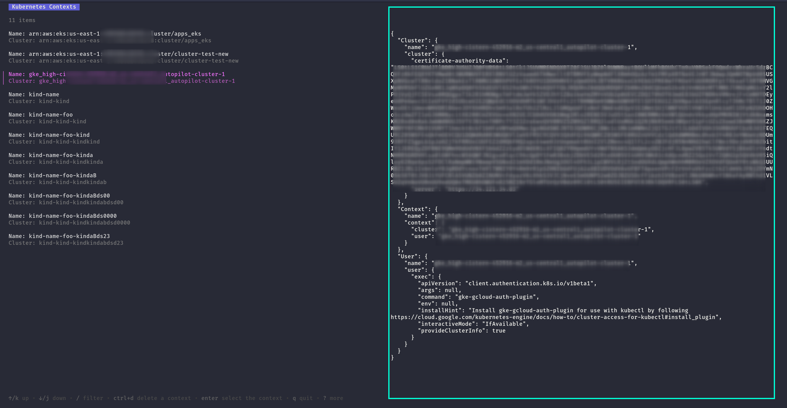
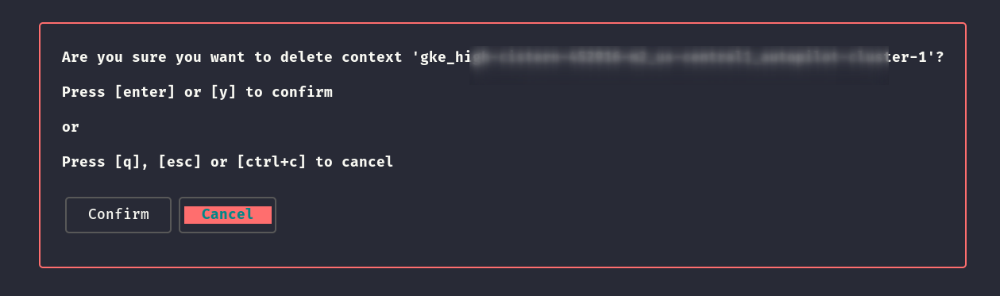

# kctx-navigator

A **simple Go TUI app** to help you **navigate**, **switch**, and **delete** Kubernetes contexts interactively from your terminal.

---

## ✨ Features

- ✅ **List & navigate** through your available Kubernetes contexts
- ✅ **Switch** active context with a single keypress
- ✅ **Delete** unwanted contexts with confirmation prompt
- ✅ **Clean and responsive TUI** powered by [Bubble Tea](https://github.com/charmbracelet/bubbletea) and [Lipgloss](https://github.com/charmbracelet/lipgloss)

---

## 🖥️ Screenshots

### 1️⃣ Context Selector (Navigation Panel)

Browse and select contexts:



---

### 2️⃣ Delete Context (Confirmation Prompt)

Confirm before deleting:



---

## 📦 Installation

```bash
  Download the latest release
```
