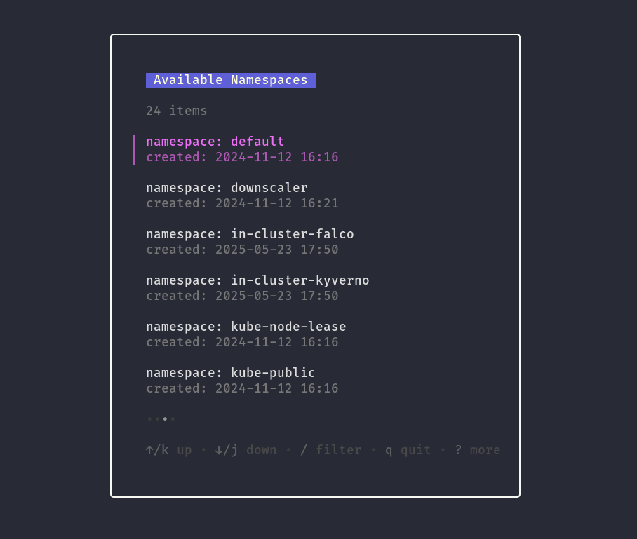

# kcmgr - Kubernetes Context Manager

A **simple Go TUI app** to help you **navigate**, **switch**, and **delete** Kubernetes contexts interactively from your terminal.

---

## Features

- **List & navigate** through your available Kubernetes contexts
- **Switch** active context with a single keypress
- **Delete** unwanted contexts with confirmation prompt
- **Clean and responsive TUI** powered by [Bubble Tea](https://github.com/charmbracelet/bubbletea) and [Lipgloss](https://github.com/charmbracelet/lipgloss)

---

## Screenshots

### Context Selector (Navigation Panel)

Browse and select contexts:


---

### Delete Context (Confirmation Prompt)

Confirm before deleting:


---

### Select Default Namespace with a Context



## Keyboard Shortcuts & Navigation

### Contexts Screen

| Key / Shortcut   | Action                                                                |
| ---------------- | --------------------------------------------------------------------- |
| `j` / `down`     | Move selection down                                                   |
| `k` / `up`       | Move selection up                                                     |
| `left` / `right` | Navigate between pages (if paginated)                                 |
| `/`              | Filter contexts by name                                               |
| `enter`          | Select the highlighted context and load namespaces                    |
| `ctrl+n`         | List all namespaces from the selected context (opens namespace panel) |
| `ctrl+d`         | Delete the selected context (confirmation prompt appears)             |
| `q`              | Quit the app                                                          |

---

### Namespace Panel (after pressing `ctrl+n`)

| Key / Shortcut   | Action                                                    |
| ---------------- | --------------------------------------------------------- |
| `j` / `down`     | Move selection down                                       |
| `k` / `up`       | Move selection up                                         |
| `/`              | Filter namespaces by name                                 |
| `enter`          | Set selected namespace as default for the context         |
| `esc` / `ctrl+c` | Cancel filter if filtering, or go back to Contexts screen |
| `q`              | Quit namespace panel and return to Contexts screen        |

---

### Notes:

- **Filter Mode**: When you press `/`, the app enters filter mode. Press `esc` or `ctrl+c` to exit filter mode and show the full list again.
- **Delete Confirmation**: When pressing `ctrl+d`, a confirmation prompt will appear before deleting the context.
- **Namespace Fetching**: Namespaces for a context are cached after first fetch for performance.

## Installation

```bash
  Download the latest release
```
